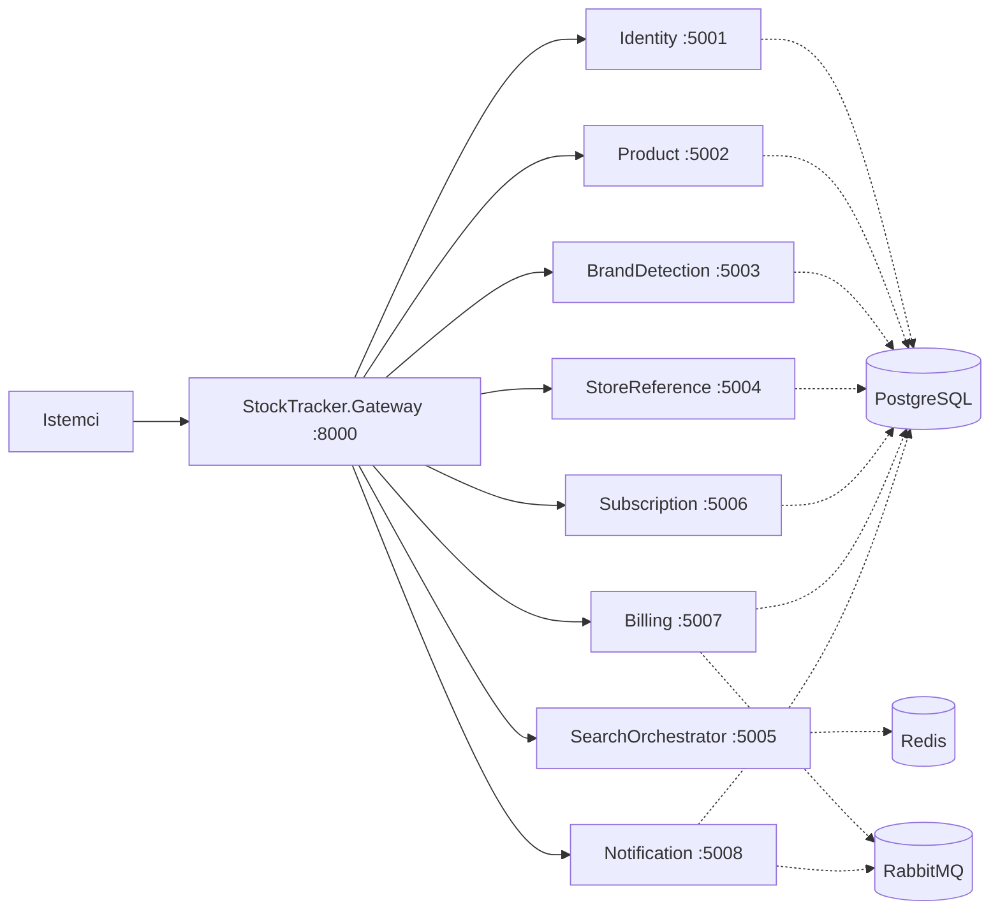

# StockTracker

StockTracker, birden fazla alan sorumluluğunu ayrı servisler halinde modelleyen .NET tabanli bir mikroservis iskeletidir. Projede API trafigi bir gateway uzerinden yonlendirilir; veri, cache ve mesajlasma altyapisi ise Docker Compose ile ayaga kaldirilir.

Bu asamada repo, servisler arasi sinirlari ve altyapi baglantilarini tanimlayan bir temel yapi sunuyor. Servislerin buyuk kismi su anda minimal API ve health endpoint seviyesinde bulunuyor.

## Icerik

- [Genel Mimari](#genel-mimari)
- [Servisler](#servisler)
- [Tech Stack](#tech-stack)
- [Gereksinimler](#gereksinimler)
- [Kurulum](#kurulum)
- [Projeyi Calistirma](#projeyi-calistirma)
- [Gateway Rotalari](#gateway-rotalari)
- [CI Bilgisi](#ci-bilgisi)
- [Gelistirme Notlari](#gelistirme-notlari)

## Genel Mimari

Sistem, istemciden gelen istekleri once gateway uzerinden alip ilgili mikroservise yonlendirecek sekilde tasarlanmis.



## Servisler

| Servis | Port | Rol |
| --- | --- | --- |
| StockTracker.Gateway | 8000 | Tum dis istekleri alan ve YARP ile ilgili servise yonlendiren API gateway |
| StockTracker.Identity | 5001 | Kimlik ve erisim yonetimi icin ayrilan servis |
| StockTracker.Product | 5002 | Urun ve stok alanina ayrilmis servis |
| StockTracker.BrandDetection | 5003 | Marka tespiti veya marka esleme akislarina ayrilan servis |
| StockTracker.StoreReference | 5004 | Magaza veya kaynak referans verilerini yoneten servis |
| StockTracker.SearchOrchestrator | 5005 | Arama akislarini orkestre etmek icin ayrilmis servis |
| StockTracker.Subscription | 5006 | Abonelik planlari ve uyelik akislarina ayrilan servis |
| StockTracker.Billing | 5007 | Odeme ve faturalama sorumlulugu icin ayrilan servis |
| StockTracker.Notification | 5008 | Bildirim gonderimi ve olay tetiklemeleri icin ayrilan servis |
| StockTracker.Shared.Contracts | - | Servisler arasi paylasilacak ortak kontratlar kutuphanesi |

## Tech Stack

| Katman | Teknoloji |
| --- | --- |
| Uygulama platformu | .NET 10, ASP.NET Core Minimal API |
| API Gateway | YARP Reverse Proxy |
| Servisler arasi ortak kutuphane | Class Library (Shared Contracts) |
| Veritabani | PostgreSQL 16 |
| Cache | Redis 7 |
| Mesajlasma | RabbitMQ 3 Management |
| Konteyner orkestrasyonu | Docker Compose |
| CI | GitHub Actions |

## Gereksinimler

- .NET SDK 10
- Docker ve Docker Compose
- Istege bagli: `curl`, `psql`, `redis-cli`, RabbitMQ UI icin tarayici

## Kurulum

1. Repo kokune gecin.
2. Ortam degiskenlerini kontrol edin. Projede hazir bir `.env` dosyasi var.
3. Altyapi servislerini baslatin:

```bash
docker compose up -d
```

4. NuGet bagimliliklarini yukleyin:

```bash
dotnet restore StockTracker.slnx
```

## Projeyi Calistirma

Her servis ayri bir terminalden calistirilabilir. Ornek akista once gateway, sonra diger servisler baslatilir.

```bash
dotnet run --project StockTracker.Gateway
dotnet run --project StockTracker.Identity
dotnet run --project StockTracker.Product
dotnet run --project StockTracker.BrandDetection
dotnet run --project StockTracker.StoreReference
dotnet run --project StockTracker.SearchOrchestrator
dotnet run --project StockTracker.Subscription
dotnet run --project StockTracker.Billing
dotnet run --project StockTracker.Notification
```

Health endpoint kontrolleri:

```bash
curl http://localhost:8000/health/gateway
curl http://localhost:5001/health
curl http://localhost:5002/health
curl http://localhost:5003/health
curl http://localhost:5004/health
curl http://localhost:5005/health
curl http://localhost:5006/health
curl http://localhost:5007/health
curl http://localhost:5008/health
```

## Gateway Rotalari

Gateway, gelen istekleri su path kaliplariyla ilgili servislere yonlendirir:

| Dis endpoint | Hedef servis |
| --- | --- |
| `/api/identity/*` | `http://localhost:5001` |
| `/api/product/*` | `http://localhost:5002` |
| `/api/brand-detection/*` | `http://localhost:5003` |
| `/api/store-reference/*` | `http://localhost:5004` |
| `/api/search/*` | `http://localhost:5005` |
| `/api/subscriptions/*` | `http://localhost:5006` |
| `/api/billing/*` | `http://localhost:5007` |
| `/api/notifications/*` | `http://localhost:5008` |

## CI Bilgisi

GitHub Actions altinda bir CI akisi bulunuyor:

- `dotnet restore`
- `dotnet build`
- `dotnet test`
- `docker compose config`

## Gelistirme Notlari

- Tum servisler su an minimal baslangic seviyesinde; cogu serviste sadece `/health` endpoint'i mevcut.
- Docker Compose, PostgreSQL icinde coklu veritabani olusturmak icin `docker/postgres-init` altindaki init script'ini kullaniyor.
- Redis ve RabbitMQ tanimlari hazir, ancak uygulama katmaninda bu baglantilari kullanan kodlar henuz eklenmemis gorunuyor.
- `StockTracker.Shared.Contracts`, ileride servisler arasi DTO ve olay kontratlarini toplamak icin ayrilmis ortak paket olarak konumlanmis.

## Dizin Yapisi

```text
.
|- StockTracker.Gateway
|- StockTracker.Identity
|- StockTracker.Product
|- StockTracker.BrandDetection
|- StockTracker.StoreReference
|- StockTracker.SearchOrchestrator
|- StockTracker.Subscription
|- StockTracker.Billing
|- StockTracker.Notification
|- StockTracker.Shared.Contracts
|- docker
|  \- postgres-init
|- docker-compose.yml
\- StockTracker.slnx
```