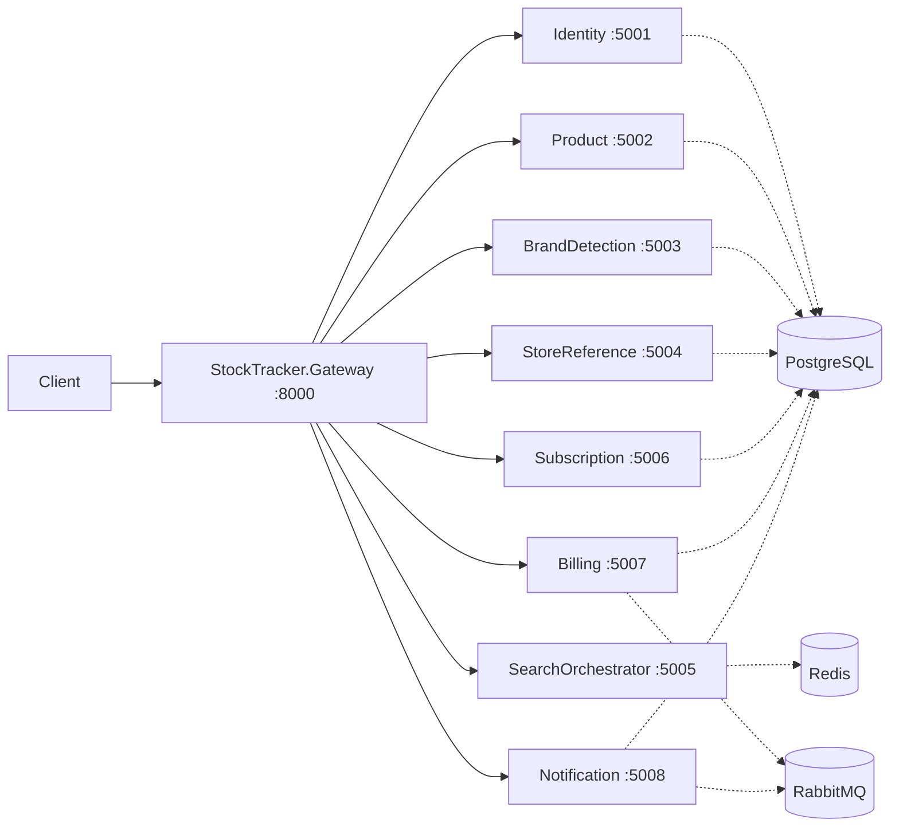

# StockTracker

StockTracker is a .NET-based microservices workspace for stock, catalog, subscription, billing, notification, and identity-related flows. Incoming traffic is routed through an API gateway, while local infrastructure is provisioned with Docker Compose.

The repository currently contains a mixed state:

- `StockTracker.Identity` already includes a working authentication flow with PostgreSQL, Entity Framework Core, JWT access tokens, and refresh tokens.
- Most other services are still scaffold-level Minimal API applications with health endpoints and reserved service boundaries.

## Table of Contents

- [Architecture](#architecture)
- [Services](#services)
- [Current Implementation Status](#current-implementation-status)
- [Tech Stack](#tech-stack)
- [Requirements](#requirements)
- [Setup](#setup)
- [Running the Project](#running-the-project)
- [Identity Service](#identity-service)
- [Gateway Routes](#gateway-routes)
- [CI](#ci)
- [Development Notes](#development-notes)
- [Project Structure](#project-structure)

## Architecture

The system is organized around a gateway-first microservice layout.



## Services

| Service | Port | Purpose |
| --- | --- | --- |
| StockTracker.Gateway | 8000 | Public entry point that forwards requests to downstream services through YARP |
| StockTracker.Identity | 5001 | Authentication and identity management |
| StockTracker.Product | 5002 | Product and stock domain boundary |
| StockTracker.BrandDetection | 5003 | Brand detection or brand matching domain boundary |
| StockTracker.StoreReference | 5004 | Store and source reference data |
| StockTracker.SearchOrchestrator | 5005 | Search orchestration layer |
| StockTracker.Subscription | 5006 | Subscription and plan management |
| StockTracker.Billing | 5007 | Billing and payment-related workflows |
| StockTracker.Notification | 5008 | Notification delivery workflows |
| StockTracker.Shared.Contracts | - | Shared contracts library for DTOs and cross-service message definitions |

## Current Implementation Status

| Area | Status |
| --- | --- |
| Gateway routing | Implemented |
| Identity auth flow | Implemented |
| PostgreSQL container setup | Implemented |
| Redis container setup | Implemented |
| RabbitMQ container setup | Implemented |
| Product service business endpoints | Scaffold only |
| Billing service business endpoints | Scaffold only |
| Notification service business endpoints | Scaffold only |
| Search orchestration logic | Scaffold only |

## Tech Stack

| Layer | Technology |
| --- | --- |
| Application platform | .NET 10 |
| API style | ASP.NET Core Minimal API |
| API gateway | YARP Reverse Proxy |
| ORM | Entity Framework Core 10 |
| Database provider | Npgsql for PostgreSQL |
| Authentication | JWT Bearer tokens |
| Password hashing | BCrypt.Net |
| Database | PostgreSQL 16 |
| Cache | Redis 7 |
| Messaging | RabbitMQ 3 Management |
| Container orchestration | Docker Compose |
| CI | GitHub Actions |

## Requirements

- .NET SDK 10
- Docker and Docker Compose
- Optional tools: `curl`, `psql`, `redis-cli`

## Setup

1. Move to the repository root.
2. Review the existing `.env` file.
3. Start local infrastructure:

```bash
docker compose up -d
```

4. Restore NuGet packages:

```bash
dotnet restore StockTracker.slnx
```

## Running the Project

You can run each service in a separate terminal.

```bash
dotnet run --project StockTracker.Gateway
dotnet run --project StockTracker.Identity
dotnet run --project StockTracker.Product
dotnet run --project StockTracker.BrandDetection
dotnet run --project StockTracker.StoreReference
dotnet run --project StockTracker.SearchOrchestrator
dotnet run --project StockTracker.Subscription
dotnet run --project StockTracker.Billing
dotnet run --project StockTracker.Notification
```

Health checks:

```bash
curl http://localhost:8000/health/gateway
curl http://localhost:5001/health
curl http://localhost:5002/health
curl http://localhost:5003/health
curl http://localhost:5004/health
curl http://localhost:5005/health
curl http://localhost:5006/health
curl http://localhost:5007/health
curl http://localhost:5008/health
```

## Identity Service

Authentication module inside `StockTracker.Identity`.

Implemented pieces:

- User registration
- User login
- JWT access token generation
- Refresh token generation and rotation
- Refresh token revocation on logout
- Automatic database migration at startup
- PostgreSQL persistence with Entity Framework Core

Default local configuration is provided in `appsettings.Development.json` for development use.

### Identity Endpoints

| Method | Endpoint | Description |
| --- | --- | --- |
| POST | `/auth/register` | Creates a user and returns access and refresh tokens |
| POST | `/auth/login` | Authenticates a user and returns tokens |
| POST | `/auth/refresh-token` | Exchanges a valid refresh token for a new auth response |
| POST | `/auth/logout` | Revokes a refresh token |
| GET | `/health` | Service health check |

### Identity Request Models

`POST /auth/register`

```json
{
    "email": "user@example.com",
    "password": "password123",
    "firstName": "Jane",
    "lastName": "Doe"
}
```

`POST /auth/login`

```json
{
    "email": "user@example.com",
    "password": "password123"
}
```

`POST /auth/refresh-token` and `POST /auth/logout`

```json
{
    "refreshToken": "..."
}
```

### Identity Configuration

The identity service expects the following settings:

| Key | Purpose |
| --- | --- |
| `ConnectionStrings:IdentityDb` | PostgreSQL connection string for the identity database |
| `JwtSettings:SecretKey` | Symmetric key used to sign JWT access tokens |
| `JwtSettings:Issuer` | Token issuer |
| `JwtSettings:Audience` | Token audience |
| `JwtSettings:AccessTokenExpiryMinutes` | Access token lifetime |
| `JwtSettings:RefreshTokenExpiryDays` | Refresh token lifetime |

For production, move these values to environment variables or a secrets store instead of keeping them in local configuration files.

## Gateway Routes

The gateway forwards requests using the following route prefixes:

| External route | Target service |
| --- | --- |
| `/api/identity/*` | `http://localhost:5001` |
| `/api/product/*` | `http://localhost:5002` |
| `/api/brand-detection/*` | `http://localhost:5003` |
| `/api/store-reference/*` | `http://localhost:5004` |
| `/api/search/*` | `http://localhost:5005` |
| `/api/subscriptions/*` | `http://localhost:5006` |
| `/api/billing/*` | `http://localhost:5007` |
| `/api/notifications/*` | `http://localhost:5008` |

## CI

The repository includes a GitHub Actions workflow that runs:

- `dotnet restore`
- `dotnet build`
- `dotnet test`
- `docker compose config`

## Development Notes

- `StockTracker.Identity` is the most complete service in the workspace right now.
- The other services still mainly expose `/health` endpoints and reserved service boundaries.
- PostgreSQL databases are initialized through the script in `docker/postgres-init`.
- Redis and RabbitMQ are provisioned in Docker Compose, but the application-level integrations are not yet implemented in most services.
- `StockTracker.Shared.Contracts` is positioned as the shared contract library for future DTO and event reuse.

## Project Structure

```text
.
|- StockTracker.Gateway
|- StockTracker.Identity
|- StockTracker.Product
|- StockTracker.BrandDetection
|- StockTracker.StoreReference
|- StockTracker.SearchOrchestrator
|- StockTracker.Subscription
|- StockTracker.Billing
|- StockTracker.Notification
|- StockTracker.Shared.Contracts
|- docker
|  \- postgres-init
|- docker-compose.yml
\- StockTracker.slnx
```