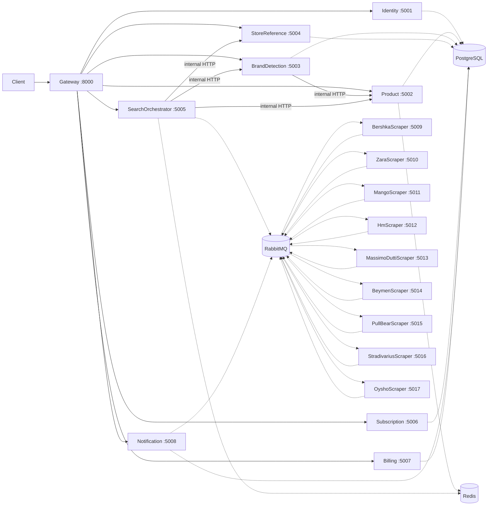

# StockTracker

A microservices-based stock availability tracking application. Users search for products by barcode or product code, select size and location (city/district), and receive real-time stock availability from both online and physical stores. When an out-of-stock item becomes available, users are notified via push and email. Business model is freemium with subscription payments.

## Table of Contents

- [Architecture](#architecture)
- [Services](#services)
- [Implementation Status](#implementation-status)
- [Tech Stack](#tech-stack)
- [Requirements](#requirements)
- [Setup](#setup)
- [Running the Project](#running-the-project)
- [Service Endpoints](#service-endpoints)
- [Gateway Routes](#gateway-routes)
- [Environment Variables](#environment-variables)
- [CI](#ci)
- [Development Notes](#development-notes)
- [Project Structure](#project-structure)

## Architecture

External client traffic flows through the API Gateway. Internal service-to-service communication bypasses the gateway and uses direct HTTP — this avoids unnecessary latency, keeps internal endpoints off the public surface, and prevents a gateway outage from breaking inter-service calls.


```mermaid
flowchart LR
    Client[Client] --> Gateway[Gateway :8000]

    Gateway --> Identity[Identity :5001]
    Gateway --> Product[Product :5002]
    Gateway --> Brand[BrandDetection :5003]
    Gateway --> Store[StoreReference :5004]
    Gateway --> Search[SearchOrchestrator :5005]
    Gateway --> Subscription[Subscription :5006]
    Gateway --> Billing[Billing :5007]
    Gateway --> Notification[Notification :5008]

    Brand -->|internal HTTP| Product
    Search -->|internal HTTP| Product
    Search -->|internal HTTP| Brand
    Search -->|internal HTTP| Store

    Identity -.-> PG[(PostgreSQL)]
    Product -.-> PG
    Brand -.-> PG
    Store -.-> PG
    Subscription -.-> PG
    Billing -.-> PG
    Notification -.-> PG

    Product -.-> Redis[(Redis)]
    Search -.-> Redis
    Search -.-> MQ[(RabbitMQ)]
    Notification -.-> MQ
    MQ -.-> Scraper[BershkaScraper :5009]
    Scraper -.-> MQ
    MQ -.-> ZaraScraper[ZaraScraper :5010]
    ZaraScraper -.-> MQ
    MQ -.-> MangoScraper[MangoScraper :5011]
    MangoScraper -.-> MQ
    MQ -.-> HmScraper[HmScraper :5012]
    HmScraper -.-> MQ
    MQ -.-> MassimoDuttiScraper[MassimoDuttiScraper :5013]
    MassimoDuttiScraper -.-> MQ
    MQ -.-> BeymenScraper[BeymenScraper :5014]
    BeymenScraper -.-> MQ
    MQ -.-> PullBearScraper[PullBearScraper :5015]
    PullBearScraper -.-> MQ
    MQ -.-> StradivariusScraper[StradivariusScraper :5016]
    StradivariusScraper -.-> MQ
    MQ -.-> OyshoScraper[OyshoScraper :5017]
    OyshoScraper -.-> MQ
```

## Services

| Service | Port | Responsibility | Status |
| --- | --- | --- | --- |
| StockTracker.Gateway | 8000 | YARP reverse proxy, JWT validation, rate limiting | ✅ Done |
| StockTracker.Identity | 5001 | Registration, login, JWT + refresh token management | ✅ Done |
| StockTracker.Product | 5002 | Barcode/code lookup, brand mapping, Redis cache | ✅ Done |
| StockTracker.BrandDetection | 5003 | Regex format matching, manual brand selection | ✅ Done |
| StockTracker.StoreReference | 5004 | City/district → brand-specific store ID mapping | ✅ Done |
| StockTracker.SearchOrchestrator | 5005 | Routes user queries to scraper queues, throttling | ✅ Done |
| StockTracker.Subscription | 5006 | Watch groups, tracking list, deduplication, Quartz-based stock poller | ✅ Done — watch group model (Faz 3.1) + stock poller (Faz 3.2); notifications still planned |
| StockTracker.Billing | 5007 | Freemium plans, App Store/Play Store IAP verification + webhooks | ✅ Done — plan model (Faz 4.1) + IAP verification/webhooks (Faz 4.2), pending real Apple/Google credentials |
| StockTracker.Notification | 5008 | FCM push + email notifications | ✅ Done — restock detection, idempotency, real SMTP integration (own mail server, no 3rd-party email provider) wired (real Firebase account + SMTP server credentials pending) |
| StockTracker.BershkaScraper | 5009 | Consumes `CheckStockCommand`, publishes `StockResultEvent` | ✅ Done — real Bershka/Inditex API wired up |
| StockTracker.ZaraScraper | 5010 | Consumes `CheckStockCommand`, publishes `StockResultEvent` | ✅ Done — real Zara API wired up (live end-to-end Chrome smoke-test still pending) |
| StockTracker.MangoScraper | 5011 | Consumes `CheckStockCommand`, publishes `StockResultEvent` | ✅ Done — real Mango API wired up, live end-to-end verified (no bot protection, no Playwright needed) |
| StockTracker.HmScraper | 5012 | Consumes `CheckStockCommand`, publishes `StockResultEvent` | ✅ Done — online stock live-verified via an unprotected API (`ofg.hm.com`, no Playwright needed); store query still needs Playwright (see Development Notes below) |
| StockTracker.MassimoDuttiScraper | 5013 | Consumes `CheckStockCommand`, publishes `StockResultEvent` | ✅ Done — real Massimo Dutti API wired up (hybrid: Playwright for online stock, plain HttpClient for the unprotected store stock API, verified with real quantities; see Development Notes below) |
| StockTracker.BeymenScraper | 5014 | Consumes `CheckStockCommand`, publishes `StockResultEvent` | ✅ Done — no Playwright needed at all, both online and store stock APIs verified live with real quantities (see Development Notes below) |
| StockTracker.PullBearScraper | 5015 | Consumes `CheckStockCommand`, publishes `StockResultEvent` | ✅ Done — same platform as Massimo Dutti, store-level stock query live-verified with real numeric stock data (see Development Notes below) |
| StockTracker.StradivariusScraper | 5016 | Consumes `CheckStockCommand`, publishes `StockResultEvent` | ✅ Done — online stock read from SSR HTML via Playwright, store stock via a real unprotected REST API found through user-shared network traffic, verified with real quantities (see Development Notes below) |
| StockTracker.OyshoScraper | 5017 | Consumes `CheckStockCommand`, publishes `StockResultEvent` | ✅ Done — shares Bershka's exact store-stock API (`api.inditex.com`), online stock read from a server-rendered Angular state script (no hydration/component-tree scan needed), verified with real quantities (see Development Notes below) |
| StockTracker.Shared.Contracts | — | Shared DTOs, RabbitMQ message contracts (`CheckStockCommand`, `StockResultEvent`) and MassTransit setup | ✅ In use |
| StockTracker.Shared.Scraping | — | Cross-scraper shared library — Redis-backed `IScraperHealthLogService`, plus `Http/` (host-based token-bucket rate limiting, realistic rotating browser header profiles, Retry-After-aware retry + separate bot-detection circuit breaker) | ✅ In use |

## Implementation Status

| Area | Status |
| --- | --- |
| Docker Compose (PostgreSQL ×7, Redis, RabbitMQ) | ✅ Done |
| API Gateway (YARP) routing | ✅ Done |
| GitHub Actions CI pipeline | ✅ Done |
| Identity Service (register, login, JWT, refresh token) | ✅ Done |
| Product Service (lookup, brand mapping, Redis cache) | ✅ Done |
| Brand Detection Service (regex format matching) | ✅ Done |
| Redis cache metrics + invalidation (Product Service) | ✅ Done |
| RabbitMQ message contracts + MassTransit setup (Shared.Contracts) | ✅ Done |
| Store Reference Service (Bershka seed data) | ✅ Done |
| Search Orchestrator + RabbitMQ integration | ✅ Done |
| Bershka Scraper (consumer, Polly, UA rotation, real Bershka/Inditex stock + store-locator API, `StockResultEvent` publish) | ✅ Done |
| Zara Scraper (consumer, real Zara SSR online stock + Akamai-protected store-availability API via in-page Playwright fetch, velocity-based rate limiting, `StockResultEvent` publish) | ✅ Done |
| Mango Scraper (consumer, real Mango RSC online stock + lat/lng-based store-finder API, no bot protection so plain resilient `HttpClient` — no Playwright, `StockResultEvent` publish) | ✅ Done — live end-to-end verified |
| H&M Scraper (consumer, real H&M online stock via an unprotected separate-domain API — no Playwright needed — + Akamai-protected lat/lng-based store-availability API via in-page Playwright fetch, non-sparse store response semantics, `StockResultEvent` publish) | ✅ Done — online stock live-verified with real quantities across multiple products, no Chrome dependency; store query still needs Playwright |
| Massimo Dutti Scraper (consumer, real Massimo Dutti `#mdfrontw-state` online stock via Playwright + unprotected per-store stock API via plain `HttpClient` with real quantities, `StockResultEvent` publish) | ✅ Done — store-level stock query live-verified with real numeric stock data |
| Beymen Scraper (consumer, real Beymen `productsummary`/`getstorestock` APIs — no Playwright at all, real online quantities + sparse per-store availability, `StockResultEvent` publish) | ✅ Done — both APIs live-verified via real user-shared `curl` requests |
| Pull&Bear Scraper (consumer, same platform as Massimo Dutti — Playwright for online stock via `<product-modular>` custom element, plain `HttpClient` for the unprotected store stock API with real quantities, `StockResultEvent` publish) | ✅ Done — store-level stock query live-verified with real numeric stock data |
| Stradivarius Scraper (consumer, online stock read directly from SSR HTML via Playwright — no polling needed; store stock via a real unprotected REST API — `skus-availability-in-stores/actions/filter` — found through user-shared network traffic, called with a guest-session Bearer token read from cookies during the same PDP visit, `StockResultEvent` publish) | ✅ Done — both online and store-level stock live-verified with real quantities across all 4 target stores |
| Oysho Scraper (consumer, online stock read from a server-rendered Angular state script (`#oyshoServer-state`) via Playwright — no hydration/component-tree scan needed; store stock via Bershka's EXACT SAME unprotected `api.inditex.com` API, `StockResultEvent` publish) | ✅ Done — store-level stock query live-verified with real numeric stock data across all 4 target stores |
| Scraper Health Monitoring (`GET /health/scraper-stats`, `GET /health/scraper-failures`, Redis-backed, shared across future scrapers) | ✅ Done |
| Scraper scalability & bot-detection hardening (host rate limiting, 429/`Retry-After`, bot-detection circuit breaker, realistic header profiles) | ✅ Done — proxy/IP rotation deferred (needs a paid provider, see ROADMAP Faz 7) |
| Subscription Service (watch groups, dedup, `POST`/`GET`/`DELETE /watches`) | ✅ Done |
| Stock Poller (Quartz.NET, watcher-count priority tiers, closes the loop via a `StockResultEvent` consumer) | ✅ Done |
| Notification Service (restock detection, idempotent `StockResultEvent` consumer, real SMTP email via own mail server — no 3rd-party provider, by user decision; FCM wired but unused pending device-token storage from Faz 5.4) | ✅ Done |
| Billing Service — plan model + event-driven auto Free-plan assignment (`UserRegisteredEvent`) | ✅ Done |
| Billing Service — App Store/Play Store IAP verification (`POST /verify-purchase`) + webhooks (`POST /webhooks/apple`, `/google`), idempotent, no separate payment gateway | ✅ Done — pending real Apple Developer/Play Console credentials |
| Watch limit enforcement — `GET /limits/{userId}` (Billing) + `POST /watches` plan-limit check (Subscription), fail-open if Billing unreachable | ✅ Done |
| React Web frontend | 🔜 Planned |
| React Native + Expo mobile app | 🔜 Planned |

## Tech Stack

| Layer | Technology |
| --- | --- |
| Application platform | .NET 10 |
| API style | ASP.NET Core Minimal API |
| API gateway | YARP Reverse Proxy |
| ORM | Entity Framework Core |
| Database | PostgreSQL 16 (one database per service) |
| Cache | Redis 7 |
| Messaging | RabbitMQ 3 |
| Password hashing | BCrypt.Net |
| Authentication | JWT Bearer tokens |
| Scraping | Playwright (real Chrome channel, Bershka Scraper, Zara Scraper, H&M Scraper, Massimo Dutti Scraper, Pull&Bear Scraper, Stradivarius Scraper, Oysho Scraper) |
| Web frontend | React (planned) |
| Mobile | React Native + Expo (planned) |
| Payment | App Store / Play Store in-app purchase (planned) — no separate payment gateway |
| Container orchestration | Docker Compose |
| CI | GitHub Actions |

## Requirements

- .NET SDK 10
- Docker Desktop
- `dotnet-ef` tool: `dotnet tool install --global dotnet-ef`

## Setup

```bash
git clone <repo-url>
cd StockTracker
cp ".env example" .env    # fill in the values
docker compose up -d
dotnet restore StockTracker.slnx
```

The PostgreSQL init script at `docker/postgres-init/init-multiple-dbs.sh` creates all seven databases automatically on first container start. It reads database names from the `POSTGRES_MULTIPLE_DATABASES` environment variable defined in `docker-compose.yml`.

**Pending real-world credentials**: every external integration built so far (own SMTP server, FCM, Apple App Store Server API, Google Play Developer API) is wired against the real protocol/API but currently running on `.env` placeholders — see `.claude/PENDING_INPUTS.md` for the full checklist of accounts/credentials still needed and what happens without them (graceful degrade, not a crash). Note: email intentionally does **not** use a third-party provider (SendGrid/Postmark/SES) — by user decision, it sends via your own SMTP server (MailKit).

**One extra one-time step if you'll run `StockTracker.BershkaScraper`, `StockTracker.ZaraScraper`, `StockTracker.HmScraper`, `StockTracker.MassimoDuttiScraper`, `StockTracker.PullBearScraper`, `StockTracker.StradivariusScraper`, or `StockTracker.OyshoScraper`:** all seven drive a real Chrome via Playwright (see Development Notes below — the bundled Chromium gets blocked, a real Chrome channel is required), and `dotnet restore` does not download the browser binary. Build the project once, then run the Playwright browser install (`chrome` channel, not `chromium`) — see `.claude/ENVIRONMENT_SETUP.md` → "Bershka Scraper — Playwright/Chrome Kurulumu" for exact commands (same install, shared by all seven scrapers). This step isn't visible from a fresh clone because it lands in the gitignored `bin/` folder, so it's easy to miss — do it before your first `dotnet run --project StockTracker.BershkaScraper`, `StockTracker.ZaraScraper`, `StockTracker.HmScraper`, `StockTracker.MassimoDuttiScraper`, `StockTracker.PullBearScraper`, `StockTracker.StradivariusScraper`, or `StockTracker.OyshoScraper`.

## Running the Project

Each service runs on a fixed port. Open a separate terminal for each:

```bash
dotnet run --project StockTracker.Gateway           # :8000
dotnet run --project StockTracker.Identity          # :5001
dotnet run --project StockTracker.Product           # :5002
dotnet run --project StockTracker.BrandDetection    # :5003
dotnet run --project StockTracker.StoreReference    # :5004
dotnet run --project StockTracker.SearchOrchestrator # :5005
dotnet run --project StockTracker.Subscription      # :5006
dotnet run --project StockTracker.Billing           # :5007
dotnet run --project StockTracker.Notification      # :5008
dotnet run --project StockTracker.BershkaScraper    # :5009 (RabbitMQ consumer only, no HTTP endpoints besides /health)
dotnet run --project StockTracker.ZaraScraper       # :5010 (RabbitMQ consumer only, no HTTP endpoints besides /health)
dotnet run --project StockTracker.MangoScraper      # :5011 (RabbitMQ consumer only, no HTTP endpoints besides /health; no Playwright needed)
dotnet run --project StockTracker.HmScraper         # :5012 (RabbitMQ consumer only, no HTTP endpoints besides /health; requires Playwright/Chrome)
dotnet run --project StockTracker.MassimoDuttiScraper # :5013 (RabbitMQ consumer only, no HTTP endpoints besides /health; requires Playwright/Chrome for online stock, plain HttpClient for store stock)
dotnet run --project StockTracker.BeymenScraper     # :5014 (RabbitMQ consumer only, no HTTP endpoints besides /health; no Playwright needed at all)
dotnet run --project StockTracker.PullBearScraper   # :5015 (RabbitMQ consumer only, no HTTP endpoints besides /health; requires Playwright/Chrome for online stock, plain HttpClient for store stock)
dotnet run --project StockTracker.StradivariusScraper # :5016 (RabbitMQ consumer only, no HTTP endpoints besides /health; requires Playwright/Chrome for online stock, plain HttpClient with a Bearer token for store stock)
dotnet run --project StockTracker.OyshoScraper      # :5017 (RabbitMQ consumer only, no HTTP endpoints besides /health; requires Playwright/Chrome for online stock, plain HttpClient for store stock — shares Bershka's exact store-stock API)
```

When working on a single service, bring up only the infrastructure and run that service from your IDE:

```bash
docker compose up -d    # starts PostgreSQL, Redis, RabbitMQ
# then run the target service from your IDE in Debug mode
```

Health check all services:

```bash
curl http://localhost:8000/health/gateway
for port in 5001 5002 5003 5004 5005 5006 5007 5008 5009 5010 5011 5012 5013 5014 5015 5016 5017; do
  echo -n ":$port → " && curl -s http://localhost:$port/health
  echo
done
```

## Service Endpoints

### Identity Service (`:5001`)

| Method | Path | Description |
| --- | --- | --- |
| POST | `/auth/register` | Create account, returns token pair |
| POST | `/auth/login` | Authenticate, returns token pair |
| POST | `/auth/refresh` | Exchange refresh token for new token pair |
| POST | `/auth/logout` | Revoke refresh token |
| GET | `/health` | Health check |

**Register / Login request:**
```json
{ "email": "user@example.com", "password": "password123", "firstName": "Jane", "lastName": "Doe" }
```

**Refresh / Logout request:**
```json
{ "refreshToken": "..." }
```

**Response (register + login):**
```json
{
  "accessToken": "...",
  "refreshToken": "...",
  "accessTokenExpiresAt": "...",
  "user": { "id": "...", "email": "...", "firstName": "...", "lastName": "...", "isEmailVerified": false }
}
```

### Product Service (`:5002`)

| Method | Path | Description |
| --- | --- | --- |
| GET | `/lookup/{productCode}` | Resolve brand for a product code (cache → DB) |
| POST | `/mappings` | Save a resolved brand mapping (invalidates cache entry) |
| GET | `/brands` | List all active brands |
| GET | `/cache/metrics` | Cache hit/miss counts and hit rate |
| DELETE | `/cache/{code}` | Manually evict a product code's cache entry (debug/test) |
| GET | `/health` | Health check |

**Lookup response (resolved):**
```json
{
  "productCode": "12345/678/123",
  "codeType": "BrandSpecific",
  "isResolved": true,
  "brandId": "...",
  "brandName": "Zara",
  "scraperQueueName": "zara",
  "confidence": 3,
  "resolvedVia": 1,
  "fromCache": false
}
```

**Lookup response (unresolved):**
```json
{
  "productCode": "UNKNOWN123",
  "codeType": "Unknown",
  "isResolved": false,
  "brandId": null,
  "brandName": null
}
```

### Brand Detection Service (`:5003`)

| Method | Path | Description |
| --- | --- | --- |
| POST | `/resolve` | Detect brand via regex pattern matching |
| POST | `/resolve/manual` | Save user-selected brand mapping |
| GET | `/health` | Health check |

**Resolve request:**
```json
{ "productCode": "12345/678/123" }
```

**Resolve response:**
```json
{
  "productCode": "12345/678/123",
  "isResolved": true,
  "candidates": [
    { "brandId": "...", "brandName": "Zara", "confidence": 3, "matchedPattern": "^\\d{5}/\\d{3}/\\d{2,3}$" }
  ]
}
```

**Manual resolve request:**
```json
{ "productCode": "1234567", "brandId": "...", "brandName": "Bershka" }
```

### Store Reference Service (`:5004`)

| Method | Path | Description |
| --- | --- | --- |
| GET | `/stores?brandId=&city=&district=` | List active stores, all filters optional (case-insensitive city/district match) |
| GET | `/health` | Health check |

**Response:**
```json
[
  {
    "id": "d1111111-0000-0000-0000-000000000001",
    "brandId": "a1b2c3d4-e5f6-7890-abcd-ef1234567890",
    "brandName": "Bershka",
    "city": "Istanbul",
    "district": "Kadikoy",
    "storeName": "Bershka Kadikoy",
    "brandSpecificStoreId": "BSK-IST-KDK-01"
  }
]
```
Seed data covers Bershka (4 stores, real store-locator IDs, e.g. `16884` for City's Kozyatağı in Kadıköy — `UpdateBershkaStoresWithRealIds` migration) and Zara (4 matching stores across the same cities/districts, real `physicalStoreId`s, e.g. `251` for Kentpark in Ankara — `AddZaraStores` migration). See `.claude/DATABASE.md` for the full mapping.

### Search Orchestrator (`:5005`)

| Method | Path | Description |
| --- | --- | --- |
| POST | `/search` | Resolve brand (via Product/Brand Detection), resolve store (via Store Reference), and dispatch `CheckStockCommand` per location |
| GET | `/health` | Health check |

**Search request:**
```json
{
  "userId": "...",
  "productCode": "12345/678/123",
  "size": "38",
  "locations": [{ "city": "Istanbul", "district": "Kadikoy" }]
}
```
`locations` is optional — omit it (or send `null`) for an online-only stock check. For each location, Search Orchestrator queries Store Reference Service: if one or more stores match, one `CheckStockCommand` is sent per store (with a real `storeId`); if none match, a single command is sent with `storeId: null` so the scraper can still perform an online-only check.

**Response (brand known — `202 Accepted`):**
```json
{ "searchId": "...", "status": "Queued", "message": "İsteğiniz alındı, stok sonucu bildirim ile iletilecek.", "candidates": null }
```

**Response (brand unknown/ambiguous — `200 OK`):**
```json
{
  "searchId": "...",
  "status": "BrandUnknown",
  "message": "Birden fazla marka adayı bulundu. Lütfen /api/brand-detection/resolve/manual ile manuel seçim yapın.",
  "candidates": [{ "brandId": "...", "brandName": "Bershka", "confidence": "Medium", "matchedPattern": "^\\d{7,9}$" }]
}
```

**Throttled (same user + product code + size within 30s — `429 Too Many Requests`):**
```json
{ "message": "Bu ürün/beden için aramanız zaten işleniyor. Lütfen kısa süre sonra tekrar deneyin." }
```

## Gateway Routes

All external traffic goes through the gateway at `http://localhost:8000`.

| External prefix | Target service | Port |
| --- | --- | --- |
| `/api/identity/*` | Identity | 5001 |
| `/api/product/*` | Product | 5002 |
| `/api/brand-detection/*` | Brand Detection | 5003 |
| `/api/store-reference/*` | Store Reference | 5004 |
| `/api/search/*` | Search Orchestrator | 5005 |
| `/api/subscriptions/*` | Subscription | 5006 |
| `/api/billing/*` | Billing | 5007 |
| `/api/notifications/*` | Notification | 5008 |

The prefix is stripped before forwarding (e.g. `/api/product/lookup/123` → `/lookup/123`).

## Environment Variables

All secrets are provided via environment variables, never hardcoded in `appsettings.json`.

| Variable | Used by |
| --- | --- |
| `POSTGRES_USER` | Docker Compose |
| `POSTGRES_PASSWORD` | Docker Compose |
| `RABBITMQ_USER` | Docker Compose, all services (MassTransit) |
| `RABBITMQ_PASSWORD` | Docker Compose, all services (MassTransit) |
| `RABBITMQ_HOST` | All services (MassTransit) — defaults to `localhost` |
| `IDENTITY_DB_CONNECTION` | Identity Service |
| `JWT_SECRET_KEY` | Identity Service |
| `JWT_ISSUER` | Identity Service |
| `JWT_AUDIENCE` | Identity Service |
| `PRODUCT_DB_CONNECTION` | Product Service |
| `REDIS_CONNECTION` | Product Service |
| `BRAND_DB_CONNECTION` | Brand Detection Service |
| `PRODUCT_SERVICE_URL` | Brand Detection Service, Search Orchestrator (internal HTTP) |
| `BRAND_DETECTION_SERVICE_URL` | Search Orchestrator (internal HTTP) |
| `STORE_REFERENCE_SERVICE_URL` | Search Orchestrator (internal HTTP) |
| `STORE_DB_CONNECTION` | Store Reference Service |
| `BERSHKA_STOCK_API_BASE_URL` | Bershka Scraper — `https://api.inditex.com` (stock query endpoint) |
| `OYSHO_STOCK_API_BASE_URL` | Oysho Scraper — `https://api.inditex.com` (same stock query endpoint as Bershka) |

Zara Scraper needs no equivalent `ZARA_STOCK_API_BASE_URL` — unlike Bershka, there is no separate stock API host; both online and store-availability data are read via Playwright directly against `www.zara.com` (relative paths hardcoded in `PlaywrightZaraFetcher`, since the endpoint is Akamai-protected and must be called from within an already-cleared browser session — see Development Notes below). It reuses `REDIS_CONNECTION` and the shared RabbitMQ env vars, same as Bershka.

Mango Scraper also needs no extra env var — its store-finder API host (`api.shop.mango.com`) is hardcoded in `MangoStockApiClient`'s typed `HttpClient` registration, since (unlike Zara) it isn't behind any bot protection and doesn't need special session handling. Reuses `REDIS_CONNECTION` and shared RabbitMQ env vars.

H&M Scraper needs no extra env var either — its online-stock base URL (`https://ofg.hm.com`) is hardcoded in `Program.cs`'s typed `HttpClient` registration, and store-availability data is still read via Playwright directly against `www2.hm.com` (relative paths hardcoded in `PlaywrightHmFetcher`, since that endpoint is on the same Akamai-protected domain and must be called from within an already-cleared browser session — see Development Notes below). Reuses `REDIS_CONNECTION` and shared RabbitMQ env vars.

Massimo Dutti Scraper also needs no extra env var — its base URL (`https://www.massimodutti.com`) is hardcoded in `Program.cs`'s typed `HttpClient` registration for the store stock call, and the Playwright fetcher navigates directly to whatever `ProductUrl` is stored per product (see Development Notes below for why this is a hybrid scraper — online stock needs Playwright, but the store stock API doesn't). Reuses `REDIS_CONNECTION` and shared RabbitMQ env vars.

Beymen Scraper also needs no extra env var — its base URL (`https://www.beymen.com`) is hardcoded in `Program.cs`'s typed `HttpClient` registration, and the API key/client ID used by its online-stock endpoint are hardcoded constants in `BeymenApiClient` (extracted from live front-end traffic, not session-specific — see Development Notes below for why this scraper needs no Playwright at all). Reuses `REDIS_CONNECTION` and shared RabbitMQ env vars.

Pull&Bear Scraper also needs no extra env var — its base URL (`https://www.pullandbear.com`) is hardcoded in `Program.cs`'s typed `HttpClient` registration for the store stock call, and the Playwright fetcher navigates directly to whatever `ProductUrl` is stored per product (see Development Notes below — this scraper shares the exact same hybrid architecture as Massimo Dutti). Reuses `REDIS_CONNECTION` and shared RabbitMQ env vars.

Stradivarius Scraper also needs no extra env var — its base URL (`https://www.stradivarius.com`) is hardcoded in `Program.cs`'s typed `HttpClient` registration for the store stock call, and the Playwright fetcher navigates directly to whatever `ProductUrl` is stored per product (see Development Notes below for the hybrid architecture and the guest-session Bearer token). Reuses `REDIS_CONNECTION` and shared RabbitMQ env vars.

Oysho Scraper needs the same `OYSHO_STOCK_API_BASE_URL` treatment as Bershka — it shares the exact same `api.inditex.com` store-stock host, so it gets its own env var pointing at the same URL rather than hardcoding it (see Development Notes below for why the two brands share a backend despite different PDP platforms). Reuses `REDIS_CONNECTION` and shared RabbitMQ env vars.

Copy `.env example` to `.env` and fill in the values. The `.env` file is gitignored.

## CI

GitHub Actions workflow at `.github/workflows/ci.yml` runs on every push to `main` and on pull requests:

- `dotnet restore`
- `dotnet build --configuration Release`
- `dotnet test --configuration Release`
- `docker compose config` (validates docker-compose.yml)

## Development Notes

- Internal service URLs (e.g. `PRODUCT_SERVICE_URL`) point directly to service ports, not through the gateway.
- Migrations run automatically at startup via `db.Database.MigrateAsync()`.
- All `appsettings.json` files use `"REPLACE_WITH_ENV"` as a placeholder for secrets.
- RabbitMQ management UI is available at `http://localhost:15672`.
- PostgreSQL databases are created by `docker/postgres-init/init-multiple-dbs.sh` on first container start.
- MassTransit is pinned to `8.5.5` in `StockTracker.Shared.Contracts` — v9+ requires a commercial license, so do not bump past the 8.x line without re-checking licensing.
- Message contracts live in `StockTracker.Shared.Contracts/Messages/V1/` and are wired up per-service via `AddStockTrackerRabbitMq(...)`. Queue naming follows `QueueNaming.StockCheckQueue(brandName)` → `stock.check.{brandName}`, one isolated queue per brand.
- **Bershka Scraper reads real per-size stock data from the product page itself** — Bershka's product pages are behind Akamai Bot Manager, so a plain `HttpClient` can never load them, and even Playwright's bundled Chromium gets an instant "Access Denied"; `PlaywrightPdpFetcher` drives a real Chrome channel instead. Rather than parsing the page's minified JS as text (unreliable — some pages hoist string values into shared variables, so the real value is never written as a literal), it walks the page's live Vue component tree (`page.EvaluateAsync`) to read the already-resolved size/stock/part-number data straight from JS runtime state. Results are cached in Redis per product URL (15 min TTL) so repeated searches for the same product don't re-trigger Playwright. The store-specific physical stock check then queries `api.inditex.com/.../stock/campaign/...` with the real part-number read from the page. **Requires a one-time Playwright Chrome-channel install per machine** — see `.claude/ENVIRONMENT_SETUP.md` and the Setup section above. Full details, the productCode-format pitfalls that led here, and known limitations are in `.claude/ARCHITECTURE.md` → Bershka Scraper.
- **Zara Scraper's store-availability check has no Akamai-free API to fall back on, unlike Bershka** — Bershka has a separate stock API host (`api.inditex.com`) that isn't behind Akamai, so a plain resilient `HttpClient` can call it directly once the part-number is known. Zara has no such host: its `store-product-availability` endpoint lives on `www.zara.com` itself and is protected exactly like the product page (confirmed live: `curl` gets 403 even with a realistic User-Agent). So `PlaywrightZaraFetcher` calls it via an in-page `fetch()` (`page.EvaluateAsync`) after navigating to the product page, reusing the cookies from the Akamai-cleared browser session rather than a separate HTTP client. Online stock, by contrast, is simpler than Bershka's: Zara embeds it server-side as `window.zara.viewPayload.product.detail.colors[].sizes[]`, no Vue-tree walk needed. A live-verified quirk: the endpoint enforces **velocity-based** rate limiting — a handful of rapid successive store-availability calls (even to a query that had just succeeded) got the whole browser session blocked, which a 15s pause did not clear. `PlaywrightZaraFetcher` therefore serializes store queries through a semaphore with a mandatory ~6s gap between them. Full details (including the sparse-response semantics — a store missing from the response array means "no stock there", not an error) are in `.claude/ARCHITECTURE.md` → Zara Scraper.
- **Mango Scraper needs no Playwright at all** — unlike Bershka/Zara, neither its product page nor its store-finder API sits behind any bot-management system (confirmed live: plain `curl` with a realistic User-Agent gets a full `200` on both). So both `IMangoPdpFetcher` and `IMangoStockApiClient` are backed by plain resilient `HttpClient`s (same shared rate-limiting/retry/circuit-breaker policies as Bershka, applied out of politeness rather than necessity). Online stock comes from Next.js App Router's React Server Components stream (`self.__next_f.push([N, "..."])` chunks embedded in `<script>` tags) rather than a classic `__NEXT_DATA__` global — `MangoPdpFetcher` decodes the doubly-escaped JSON properly (outer array via `System.Text.Json`, then a bracket-balanced scan for the inner `"colors":[...]` array) rather than hand-rolled string replacement, since a naive unescape would mangle unicode/backslash sequences. The store-based check is architecturally different from Zara's: instead of querying a specific store ID, Mango's `store-finder/v2/stores/stock` endpoint takes a latitude/longitude and returns nearby stores — passing a store's own coordinates reliably surfaces that store (confirmed live), which is why `CheckStockCommand` (V2) gained `StoreLatitude`/`StoreLongitude` fields and `Store` gained matching nullable columns, Mango-only. Same sparse-response semantics as Zara apply (a real, existing store missing from the response means it doesn't carry that product/color, not an error).
- **H&M Scraper went through a real architecture correction: online stock no longer needs Playwright at all.** The original implementation read `ssrAvailability` out of the PDP's `__NEXT_DATA__` via Playwright, because H&M's product page is Akamai-protected (confirmed live: running the compiled `PlaywrightHmFetcher` via a real Chrome channel got `403` on the PDP navigation itself, a more severe version of Zara's automation-detection block — the exact same URL loaded fine in a genuine, non-automated browser at the same moment, confirming it isn't IP-based). Three real `curl` requests the user shared from their own browser's Network tab revealed `GET ofg.hm.com/pdh-availability/v1/product/tr/availability/{productId}` — a completely separate domain, outside Akamai's protection on `www2.hm.com` entirely (confirmed live: a cookie-free `fetch` with `credentials:'omit'` still returns `200` with real data). Its response (`{"availability":[...13-digit SKUs],"fewPieceLeft":[...]}`) is byte-for-byte identical to the PDP's own `ssrAvailability` field — it's the same backend API the Next.js server calls internally. Online stock now hits this endpoint via a plain, resilience-policied `HttpClient`, no Chrome dependency at all. The one piece still requiring Playwright is the size-name↔code mapping (`aemData.productArticleDetails.variations[articleCode].sizes[]`, only found embedded in the protected PDP HTML) — but since this rarely changes for a given product, it's cached for 24 hours (vs. the usual 15 minutes), cutting Playwright usage from "every stock check" to "roughly once per product per day." The store-based check (`/tr_tr/sis/tr/{productId}/{artId}` with a latitude/longitude, same "nearby stores" style as Mango) is unchanged — it's on the same protected `www2.hm.com` domain (also confirmed to work cookie-free via a real browser, but a plain .NET `HttpClient`'s TLS/browser fingerprint is assumed insufficient to pass Akamai the way a real Chrome instance does, so it's kept behind Playwright out of caution). Unlike Zara/Mango's **sparse** responses, H&M returns **every** nearby store including fully out-of-stock ones with an explicit `traffLightInd` (`G`/`Y`/`R`), so a target store missing from the response is treated as `Unknown`, not `OutOfStock`. The `avaiQty` field only ever returns bucketed placeholder values (`0`/`1000`/`2000`/`3000`, never an exact count), so it's deliberately never surfaced via `Quantity`. All 22 unit tests pass against a mocked `IHmPdpFetcher` and a fake online-stock `HttpClient`; the `ofg.hm.com` endpoint was additionally verified live against real `www2.hm.com` products with real stock data.
- **Massimo Dutti Scraper is a hybrid — same domain, two different bot-protection outcomes** — confirmed live via `curl`: the product page (SSR HTML) and the `itxrest/2/catalog/.../detail` API are both Akamai-protected (the product page returns a `bm-verify`-parameterized JS-redirect challenge page instead of real content; the catalog API returns a flat `403 Service Unavailable`), but the actual per-store stock API (`api/storefront/1/stores/{storeId}/products/{catEntryId}/available-sizes`) on the exact same domain is **not** protected at all (plain `curl` gets a real `200` with genuine, numeric stock data). So online stock uses Playwright (real Chrome channel) against an Angular SSR state script (`#mdfrontw-state`, `colors[].sizes[].isBuyable`/`backSoon` — no double-escaping, unlike Mango's RSC stream), while store-level stock uses a plain resilient `HttpClient` — the same "Playwright for PDP, plain HttpClient for the stock API" split as Bershka, just landing on one shared domain instead of two. Unlike Mango/H&M, the store query needs no latitude/longitude — it takes the physical store ID directly (Zara-style), plus the product's `catEntryId` and `mastersSizeId`, both resolved from the PDP. The response is **sparse** (Zara/Mango-style: a store missing from the response means it doesn't carry that size, confirmed live for Cevahir/Şişli) and returns a **real numeric stock count** (`stock`), which is why this is the only scraper besides Zara/Bershka where `Quantity`/`IsLastUnit` are populated for store-level checks. **Correction**: an earlier version of this scraper mistakenly used the general store-locator API (`itxrest/2/bam/store/.../physical-store`, which needs lat/lng) for the stock check and misread its unrelated `receiveStockQuery` flag (always `false` for Turkey) as "store stock checking unsupported here." Live user testing showed real per-store stock data in the UI, which led to finding the correct dedicated endpoint above — the store-locator API is now only used for discovering store IDs during onboarding, not at runtime. All 21 unit tests pass against a mocked `IMassimoDuttiPdpFetcher` and a fake store-stock `HttpClient`, and the store-query logic was additionally verified live against the real API via `curl`.
- **Beymen Scraper needs no Playwright at all — its stock APIs are entirely separate from its Incapsula-protected main site** — Beymen's main website (SSR pages, even `robots.txt`) is protected by Incapsula (Imperva), a different WAF vendor from Akamai used by Zara/Bershka/H&M/Massimo Dutti, and — unusually — this specific development environment's network/IP was blocked outright by that WAF (confirmed the user's own browser could access the site fine, ruling out a universal or regional block). But the actual stock APIs (`sf-api/api/product/{id}/productsummary` for online stock, `api/store/getstorestock/{barcode}` for store stock) live on completely separate, unprotected paths — confirmed live via `curl` requests the user captured from their own browser's Network tab, which worked identically (with real stock data) when replayed cookie-free from this blocked environment. So there's no PDP navigation at all: `ProductUrl` isn't used by this scraper, `productCode` (a plain 7-digit numeric ID, unlike every other brand's slash-separated code) and the requested size are enough to call both APIs directly with a resilient `HttpClient`. Online stock returns a real numeric `stockQuantity` per size (used directly as `Quantity`, with `IsLastUnit` derived as `Quantity == 1`, Zara-style). Store stock is a **sparse** response (a store missing from the list means it doesn't carry that specific barcode/size) that identifies stores by their own `Name` field rather than a numeric ID (no such ID exists in this API) and exposes only an `IsAboutToRunOut` boolean per store+size rather than an exact count — honestly mapped to `IsLastUnit` as an approximation (not a literal "exactly one left" claim) with `Quantity` always `null` at the store level. All 18 unit tests pass against fake HTTP responses, and both endpoints were additionally verified live via real `curl` requests (both a full one with session cookies from the user's browser, and a stripped cookie-free version run directly from this environment).
- **Pull&Bear Scraper shares the exact same platform as Massimo Dutti** — confirmed live: both use a `<product-modular>` custom element whose `__product` JS property holds the same `detail.colors[].sizes[]` shape (`catentryId`, `mastersSizeId`, `isBuyable`, `backSoon`), and both expose the identical `api/storefront/1/stores/{storeId}/products/{catEntryId}/available-sizes` store-stock endpoint, unprotected on the same domain as the Akamai-gated product page (confirmed via `curl`: the PDP gets a `bm-verify` redirect challenge, the store API returns real numeric stock). The one architectural difference: Pull&Bear's product data is populated by client-side hydration rather than an inline SSR script, so `PlaywrightPullBearFetcher` polls for `document.querySelector('product-modular').__product` to become available (up to 8s) instead of using Massimo Dutti's fixed 3s wait. **Product code collision, by design**: Pull&Bear's code format (8-digit base + 3-digit color, e.g. `07460338/250`) is identical in shape to Massimo Dutti's — because they're the same underlying platform — so `BrandCodeSignature` regex matching alone cannot distinguish between the two brands; a bare code matches both patterns and falls through to BrandDetection's existing "multiple candidates, resolve manually" flow. This is a genuine, documented limitation of platform-sharing, not a bug. All 20 unit tests pass against a mocked `IPullBearPdpFetcher` and a fake store-stock `HttpClient`, and the store-query logic was additionally verified live against the real API via `curl` (4-6 units in stock across 3 different real stores).
- **Stradivarius Scraper doesn't share a platform with any other brand, and its store-stock architecture went through a real correction mid-project** — confirmed live: the product detail page has no `__NEXT_DATA__` at all (unlike Stradivarius's own Next.js category pages), it's a separate, older Redux-based micro-frontend; size/stock data is rendered directly into the SSR HTML (`button[data-testid="size-item"][data-sku]`, `disabled`, "Stok tükenmek üzere" text for low stock), so `PlaywrightStradivariusFetcher.FetchOnlineSizesJsonAsync` needs no hydration wait or polling at all — just a DOMContentLoaded navigation. The first live-exploration pass concluded the "MAĞAZA STOK DURUMU" (store stock) modal was rendered entirely inside a closed-mode Shadow DOM with no reachable REST API, and a coordinate-based UI-automation workaround was built and shipped. **That conclusion turned out to be wrong**: the user shared two real `curl` requests captured from their own browser's DevTools Network tab while using the modal — requests that had never shown up in our own automated traffic — revealing two genuinely unprotected REST endpoints: `GET itxrest/2/bam/store/54009571/physical-store?latitude=...&longitude=...` (store discovery by lat/lng, same pattern as Massimo Dutti/Pull&Bear/Zara, returning real numeric store IDs) and `POST api/storefront/1/stores/54009571/skus-availability-in-stores/actions/filter` with body `{"physicalStoreIds":[...],"skus":[...]}` — the real stock-check call, returning real numeric stock quantities, sparse (a store/SKU missing from the response means zero stock there). Authentication is a `Bearer {access_token}` — a JWT automatically issued to every fresh guest session (confirmed live: `user_type=guest` cookie, ~24h validity), so no login flow is needed; `IStradivariusPdpFetcher` reads this token straight out of `document.cookie` during the same PDP visit that reads the online sizes. The coordinate-based automation was removed entirely and replaced with this hybrid architecture (Playwright for online stock, a plain resilience-policied `HttpClient` with the Bearer token for store stock) — now matching Massimo Dutti/Pull&Bear's shape. All 20 unit tests pass against a mocked `IStradivariusPdpFetcher` and a fake store-stock `HttpClient`; both real endpoints were additionally verified live against `stradivarius.com` across 20 different real products and all 4 target stores, with real stock quantities.

- **Oysho Scraper shares Bershka's exact store-stock backend but a completely different PDP platform** — confirmed live via `#oyshoServer-state`'s own `CONFIG_KEY.productStockPhysicalStoreUrl` field, which points straight at `https://api.inditex.com/ocpstiencom-external/common/1/stock/campaign/$campaign/product/part-number/$partNumber` — byte-for-byte the same endpoint Bershka calls. Unlike Bershka's Nuxt/Vue component-tree scan, Oysho is a server-rendered Angular app: all product data (`colors[].sizes[]` — `availability`, `hasFewUnits`, `partnumber`, `masterSizeId`) is embedded directly as valid JSON inside the `#oyshoServer-state` script tag, so `PlaywrightOyshoFetcher` just waits for that tag to appear in the DOM and reads it — no hydration wait or component-tree walk needed. The store-stock API reproduces Bershka's `sizeId` ≠ `size` distinction exactly (confirmed live: `{"sizeId":8,"size":123,...}`), but one new wrinkle was found here that had never been tested on Bershka: calling it via plain `curl` without `Origin`/`Referer` headers returns a 403 (Akamai Access Denied) even though the endpoint itself is otherwise unprotected — adding those two headers gets a real 200 with real stock data. `store_db` seeding found real Oysho stores matching Cevahir/Kentpark/Forum Bornova (same malls as every other brand) but no real Kadıköy store — the nearest real match was in Barbaros/Beşiktaş, so a real store on Bahariye Caddesi (inside Kadıköy's own district boundaries) was used instead. 24 unit tests pass against a mocked `IOyshoPdpFetcher` and a fake store-stock `HttpClient`; the store-stock endpoint was additionally verified live against `oysho.com` across all 4 target stores with real stock quantities.

## Project Structure

```text
.
├── .claude/                    # project documentation
├── .github/workflows/          # CI pipeline
├── docker/
│   └── postgres-init/
│       └── init-multiple-dbs.sh
├── StockTracker.Gateway/
├── StockTracker.Identity/
├── StockTracker.Product/
├── StockTracker.BrandDetection/
├── StockTracker.StoreReference/
├── StockTracker.SearchOrchestrator/
├── StockTracker.Subscription/
├── StockTracker.Billing/
├── StockTracker.Notification/
├── StockTracker.BershkaScraper/
├── StockTracker.ZaraScraper/
├── StockTracker.MangoScraper/
├── StockTracker.HmScraper/
├── StockTracker.MassimoDuttiScraper/
├── StockTracker.BeymenScraper/
├── StockTracker.PullBearScraper/
├── StockTracker.StradivariusScraper/
├── StockTracker.OyshoScraper/
├── StockTracker.Shared.Contracts/
├── StockTracker.Shared.Scraping/
├── tests/                       # xUnit test projects, one per service
├── docker-compose.yml
└── StockTracker.slnx
```
