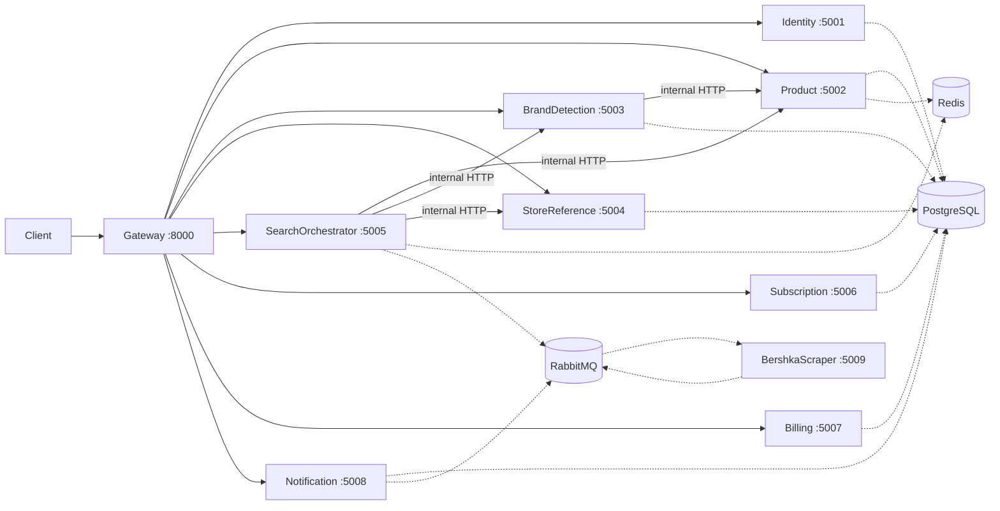

# StockTracker

A microservices-based stock availability tracking application. Users search for products by barcode or product code, select size and location (city/district), and receive real-time stock availability from both online and physical stores. When an out-of-stock item becomes available, users are notified via push and email. Business model is freemium with subscription payments.

## Table of Contents

- [Architecture](#architecture)
- [Services](#services)
- [Implementation Status](#implementation-status)
- [Tech Stack](#tech-stack)
- [Requirements](#requirements)
- [Setup](#setup)
- [Running the Project](#running-the-project)
- [Service Endpoints](#service-endpoints)
- [Gateway Routes](#gateway-routes)
- [Environment Variables](#environment-variables)
- [CI](#ci)
- [Development Notes](#development-notes)
- [Project Structure](#project-structure)

## Architecture

External client traffic flows through the API Gateway. Internal service-to-service communication bypasses the gateway and uses direct HTTP — this avoids unnecessary latency, keeps internal endpoints off the public surface, and prevents a gateway outage from breaking inter-service calls.


```mermaid
flowchart LR
    Client[Client] --> Gateway[Gateway :8000]

    Gateway --> Identity[Identity :5001]
    Gateway --> Product[Product :5002]
    Gateway --> Brand[BrandDetection :5003]
    Gateway --> Store[StoreReference :5004]
    Gateway --> Search[SearchOrchestrator :5005]
    Gateway --> Subscription[Subscription :5006]
    Gateway --> Billing[Billing :5007]
    Gateway --> Notification[Notification :5008]

    Brand -->|internal HTTP| Product
    Search -->|internal HTTP| Product
    Search -->|internal HTTP| Brand
    Search -->|internal HTTP| Store

    Identity -.-> PG[(PostgreSQL)]
    Product -.-> PG
    Brand -.-> PG
    Store -.-> PG
    Subscription -.-> PG
    Billing -.-> PG
    Notification -.-> PG

    Product -.-> Redis[(Redis)]
    Search -.-> Redis
    Search -.-> MQ[(RabbitMQ)]
    Notification -.-> MQ
    MQ -.-> Scraper[BershkaScraper :5009]
    Scraper -.-> MQ
```

## Services

| Service | Port | Responsibility | Status |
| --- | --- | --- | --- |
| StockTracker.Gateway | 8000 | YARP reverse proxy, JWT validation, rate limiting | ✅ Done |
| StockTracker.Identity | 5001 | Registration, login, JWT + refresh token management | ✅ Done |
| StockTracker.Product | 5002 | Barcode/code lookup, brand mapping, Redis cache | ✅ Done |
| StockTracker.BrandDetection | 5003 | Regex format matching, manual brand selection | ✅ Done |
| StockTracker.StoreReference | 5004 | City/district → brand-specific store ID mapping | ✅ Done |
| StockTracker.SearchOrchestrator | 5005 | Routes user queries to scraper queues, throttling | ✅ Done |
| StockTracker.Subscription | 5006 | Watch groups, tracking list, deduplication, Quartz-based stock poller | ✅ Done — watch group model (Faz 3.1) + stock poller (Faz 3.2); notifications still planned |
| StockTracker.Billing | 5007 | Freemium plans, App Store/Play Store IAP verification + webhooks | ✅ Done — plan model (Faz 4.1) + IAP verification/webhooks (Faz 4.2), pending real Apple/Google credentials |
| StockTracker.Notification | 5008 | FCM push + email notifications | ✅ Done — restock detection, idempotency, real SendGrid integration wired (real Firebase/SendGrid credentials pending) |
| StockTracker.BershkaScraper | 5009 | Consumes `CheckStockCommand`, publishes `StockResultEvent` | ✅ Done — real Bershka/Inditex API wired up |
| StockTracker.Shared.Contracts | — | Shared DTOs, RabbitMQ message contracts (`CheckStockCommand`, `StockResultEvent`) and MassTransit setup | ✅ In use |
| StockTracker.Shared.Scraping | — | Cross-scraper shared library — Redis-backed `IScraperHealthLogService`, plus `Http/` (host-based token-bucket rate limiting, realistic rotating browser header profiles, Retry-After-aware retry + separate bot-detection circuit breaker) | ✅ In use |

## Implementation Status

| Area | Status |
| --- | --- |
| Docker Compose (PostgreSQL ×7, Redis, RabbitMQ) | ✅ Done |
| API Gateway (YARP) routing | ✅ Done |
| GitHub Actions CI pipeline | ✅ Done |
| Identity Service (register, login, JWT, refresh token) | ✅ Done |
| Product Service (lookup, brand mapping, Redis cache) | ✅ Done |
| Brand Detection Service (regex format matching) | ✅ Done |
| Redis cache metrics + invalidation (Product Service) | ✅ Done |
| RabbitMQ message contracts + MassTransit setup (Shared.Contracts) | ✅ Done |
| Store Reference Service (Bershka seed data) | ✅ Done |
| Search Orchestrator + RabbitMQ integration | ✅ Done |
| Bershka Scraper (consumer, Polly, UA rotation, real Bershka/Inditex stock + store-locator API, `StockResultEvent` publish) | ✅ Done |
| Scraper Health Monitoring (`GET /health/scraper-stats`, `GET /health/scraper-failures`, Redis-backed, shared across future scrapers) | ✅ Done |
| Scraper scalability & bot-detection hardening (host rate limiting, 429/`Retry-After`, bot-detection circuit breaker, realistic header profiles) | ✅ Done — proxy/IP rotation deferred (needs a paid provider, see ROADMAP Faz 7) |
| Subscription Service (watch groups, dedup, `POST`/`GET`/`DELETE /watches`) | ✅ Done |
| Stock Poller (Quartz.NET, watcher-count priority tiers, closes the loop via a `StockResultEvent` consumer) | ✅ Done |
| Notification Service (restock detection, idempotent `StockResultEvent` consumer, real SendGrid email; FCM wired but unused pending device-token storage from Faz 5.4) | ✅ Done |
| Billing Service — plan model + event-driven auto Free-plan assignment (`UserRegisteredEvent`) | ✅ Done |
| Billing Service — App Store/Play Store IAP verification (`POST /verify-purchase`) + webhooks (`POST /webhooks/apple`, `/google`), idempotent, no separate payment gateway | ✅ Done — pending real Apple Developer/Play Console credentials |
| Watch limit enforcement — `GET /limits/{userId}` (Billing) + `POST /watches` plan-limit check (Subscription), fail-open if Billing unreachable | ✅ Done |
| React Web frontend | 🔜 Planned |
| React Native + Expo mobile app | 🔜 Planned |

## Tech Stack

| Layer | Technology |
| --- | --- |
| Application platform | .NET 10 |
| API style | ASP.NET Core Minimal API |
| API gateway | YARP Reverse Proxy |
| ORM | Entity Framework Core |
| Database | PostgreSQL 16 (one database per service) |
| Cache | Redis 7 |
| Messaging | RabbitMQ 3 |
| Password hashing | BCrypt.Net |
| Authentication | JWT Bearer tokens |
| Scraping | Playwright (real Chrome channel, Bershka Scraper) |
| Web frontend | React (planned) |
| Mobile | React Native + Expo (planned) |
| Payment | App Store / Play Store in-app purchase (planned) — no separate payment gateway |
| Container orchestration | Docker Compose |
| CI | GitHub Actions |

## Requirements

- .NET SDK 10
- Docker Desktop
- `dotnet-ef` tool: `dotnet tool install --global dotnet-ef`

## Setup

```bash
git clone <repo-url>
cd StockTracker
cp ".env example" .env    # fill in the values
docker compose up -d
dotnet restore StockTracker.slnx
```

The PostgreSQL init script at `docker/postgres-init/init-multiple-dbs.sh` creates all seven databases automatically on first container start. It reads database names from the `POSTGRES_MULTIPLE_DATABASES` environment variable defined in `docker-compose.yml`.

**Pending real-world credentials**: every third-party integration built so far (SendGrid, FCM, Apple App Store Server API, Google Play Developer API) is wired against the real API but currently running on `.env` placeholders — see `.claude/PENDING_INPUTS.md` for the full checklist of accounts/credentials still needed and what happens without them (graceful degrade, not a crash).

**One extra one-time step if you'll run `StockTracker.BershkaScraper`:** it drives a real Chrome via Playwright (see Development Notes below — the bundled Chromium gets blocked, a real Chrome channel is required), and `dotnet restore` does not download the browser binary. Build the project once, then run the Playwright browser install (`chrome` channel, not `chromium`) — see `.claude/ENVIRONMENT_SETUP.md` → "Bershka Scraper — Playwright/Chrome Kurulumu" for exact commands. This step isn't visible from a fresh clone because it lands in the gitignored `bin/` folder, so it's easy to miss — do it before your first `dotnet run --project StockTracker.BershkaScraper`.

## Running the Project

Each service runs on a fixed port. Open a separate terminal for each:

```bash
dotnet run --project StockTracker.Gateway           # :8000
dotnet run --project StockTracker.Identity          # :5001
dotnet run --project StockTracker.Product           # :5002
dotnet run --project StockTracker.BrandDetection    # :5003
dotnet run --project StockTracker.StoreReference    # :5004
dotnet run --project StockTracker.SearchOrchestrator # :5005
dotnet run --project StockTracker.Subscription      # :5006
dotnet run --project StockTracker.Billing           # :5007
dotnet run --project StockTracker.Notification      # :5008
dotnet run --project StockTracker.BershkaScraper    # :5009 (RabbitMQ consumer only, no HTTP endpoints besides /health)
```

When working on a single service, bring up only the infrastructure and run that service from your IDE:

```bash
docker compose up -d    # starts PostgreSQL, Redis, RabbitMQ
# then run the target service from your IDE in Debug mode
```

Health check all services:

```bash
curl http://localhost:8000/health/gateway
for port in 5001 5002 5003 5004 5005 5006 5007 5008 5009; do
  echo -n ":$port → " && curl -s http://localhost:$port/health
  echo
done
```

## Service Endpoints

### Identity Service (`:5001`)

| Method | Path | Description |
| --- | --- | --- |
| POST | `/auth/register` | Create account, returns token pair |
| POST | `/auth/login` | Authenticate, returns token pair |
| POST | `/auth/refresh` | Exchange refresh token for new token pair |
| POST | `/auth/logout` | Revoke refresh token |
| GET | `/health` | Health check |

**Register / Login request:**
```json
{ "email": "user@example.com", "password": "password123", "firstName": "Jane", "lastName": "Doe" }
```

**Refresh / Logout request:**
```json
{ "refreshToken": "..." }
```

**Response (register + login):**
```json
{
  "accessToken": "...",
  "refreshToken": "...",
  "accessTokenExpiresAt": "...",
  "user": { "id": "...", "email": "...", "firstName": "...", "lastName": "...", "isEmailVerified": false }
}
```

### Product Service (`:5002`)

| Method | Path | Description |
| --- | --- | --- |
| GET | `/lookup/{productCode}` | Resolve brand for a product code (cache → DB) |
| POST | `/mappings` | Save a resolved brand mapping (invalidates cache entry) |
| GET | `/brands` | List all active brands |
| GET | `/cache/metrics` | Cache hit/miss counts and hit rate |
| DELETE | `/cache/{code}` | Manually evict a product code's cache entry (debug/test) |
| GET | `/health` | Health check |

**Lookup response (resolved):**
```json
{
  "productCode": "12345/678/123",
  "codeType": "BrandSpecific",
  "isResolved": true,
  "brandId": "...",
  "brandName": "Zara",
  "scraperQueueName": "zara",
  "confidence": 3,
  "resolvedVia": 1,
  "fromCache": false
}
```

**Lookup response (unresolved):**
```json
{
  "productCode": "UNKNOWN123",
  "codeType": "Unknown",
  "isResolved": false,
  "brandId": null,
  "brandName": null
}
```

### Brand Detection Service (`:5003`)

| Method | Path | Description |
| --- | --- | --- |
| POST | `/resolve` | Detect brand via regex pattern matching |
| POST | `/resolve/manual` | Save user-selected brand mapping |
| GET | `/health` | Health check |

**Resolve request:**
```json
{ "productCode": "12345/678/123" }
```

**Resolve response:**
```json
{
  "productCode": "12345/678/123",
  "isResolved": true,
  "candidates": [
    { "brandId": "...", "brandName": "Zara", "confidence": 3, "matchedPattern": "^\\d{5}/\\d{3}/\\d{2,3}$" }
  ]
}
```

**Manual resolve request:**
```json
{ "productCode": "1234567", "brandId": "...", "brandName": "Bershka" }
```

### Store Reference Service (`:5004`)

| Method | Path | Description |
| --- | --- | --- |
| GET | `/stores?brandId=&city=&district=` | List active stores, all filters optional (case-insensitive city/district match) |
| GET | `/health` | Health check |

**Response:**
```json
[
  {
    "id": "d1111111-0000-0000-0000-000000000001",
    "brandId": "a1b2c3d4-e5f6-7890-abcd-ef1234567890",
    "brandName": "Bershka",
    "city": "Istanbul",
    "district": "Kadikoy",
    "storeName": "Bershka Kadikoy",
    "brandSpecificStoreId": "BSK-IST-KDK-01"
  }
]
```
Seed data currently covers Bershka only (4 stores across Istanbul/Ankara/Izmir) — `brandSpecificStoreId` values are now real Bershka store IDs from the store-locator API (e.g. `16884` for City's Kozyatağı in Kadıköy), applied via the `UpdateBershkaStoresWithRealIds` migration. See `.claude/DATABASE.md` for the full mapping.

### Search Orchestrator (`:5005`)

| Method | Path | Description |
| --- | --- | --- |
| POST | `/search` | Resolve brand (via Product/Brand Detection), resolve store (via Store Reference), and dispatch `CheckStockCommand` per location |
| GET | `/health` | Health check |

**Search request:**
```json
{
  "userId": "...",
  "productCode": "12345/678/123",
  "size": "38",
  "locations": [{ "city": "Istanbul", "district": "Kadikoy" }]
}
```
`locations` is optional — omit it (or send `null`) for an online-only stock check. For each location, Search Orchestrator queries Store Reference Service: if one or more stores match, one `CheckStockCommand` is sent per store (with a real `storeId`); if none match, a single command is sent with `storeId: null` so the scraper can still perform an online-only check.

**Response (brand known — `202 Accepted`):**
```json
{ "searchId": "...", "status": "Queued", "message": "İsteğiniz alındı, stok sonucu bildirim ile iletilecek.", "candidates": null }
```

**Response (brand unknown/ambiguous — `200 OK`):**
```json
{
  "searchId": "...",
  "status": "BrandUnknown",
  "message": "Birden fazla marka adayı bulundu. Lütfen /api/brand-detection/resolve/manual ile manuel seçim yapın.",
  "candidates": [{ "brandId": "...", "brandName": "Bershka", "confidence": "Medium", "matchedPattern": "^\\d{7,9}$" }]
}
```

**Throttled (same user + product code + size within 30s — `429 Too Many Requests`):**
```json
{ "message": "Bu ürün/beden için aramanız zaten işleniyor. Lütfen kısa süre sonra tekrar deneyin." }
```

## Gateway Routes

All external traffic goes through the gateway at `http://localhost:8000`.

| External prefix | Target service | Port |
| --- | --- | --- |
| `/api/identity/*` | Identity | 5001 |
| `/api/product/*` | Product | 5002 |
| `/api/brand-detection/*` | Brand Detection | 5003 |
| `/api/store-reference/*` | Store Reference | 5004 |
| `/api/search/*` | Search Orchestrator | 5005 |
| `/api/subscriptions/*` | Subscription | 5006 |
| `/api/billing/*` | Billing | 5007 |
| `/api/notifications/*` | Notification | 5008 |

The prefix is stripped before forwarding (e.g. `/api/product/lookup/123` → `/lookup/123`).

## Environment Variables

All secrets are provided via environment variables, never hardcoded in `appsettings.json`.

| Variable | Used by |
| --- | --- |
| `POSTGRES_USER` | Docker Compose |
| `POSTGRES_PASSWORD` | Docker Compose |
| `RABBITMQ_USER` | Docker Compose, all services (MassTransit) |
| `RABBITMQ_PASSWORD` | Docker Compose, all services (MassTransit) |
| `RABBITMQ_HOST` | All services (MassTransit) — defaults to `localhost` |
| `IDENTITY_DB_CONNECTION` | Identity Service |
| `JWT_SECRET_KEY` | Identity Service |
| `JWT_ISSUER` | Identity Service |
| `JWT_AUDIENCE` | Identity Service |
| `PRODUCT_DB_CONNECTION` | Product Service |
| `REDIS_CONNECTION` | Product Service |
| `BRAND_DB_CONNECTION` | Brand Detection Service |
| `PRODUCT_SERVICE_URL` | Brand Detection Service, Search Orchestrator (internal HTTP) |
| `BRAND_DETECTION_SERVICE_URL` | Search Orchestrator (internal HTTP) |
| `STORE_REFERENCE_SERVICE_URL` | Search Orchestrator (internal HTTP) |
| `STORE_DB_CONNECTION` | Store Reference Service |
| `BERSHKA_STOCK_API_BASE_URL` | Bershka Scraper — `https://api.inditex.com` (stock query endpoint) |

Copy `.env example` to `.env` and fill in the values. The `.env` file is gitignored.

## CI

GitHub Actions workflow at `.github/workflows/ci.yml` runs on every push to `main` and on pull requests:

- `dotnet restore`
- `dotnet build --configuration Release`
- `dotnet test --configuration Release`
- `docker compose config` (validates docker-compose.yml)

## Development Notes

- Internal service URLs (e.g. `PRODUCT_SERVICE_URL`) point directly to service ports, not through the gateway.
- Migrations run automatically at startup via `db.Database.MigrateAsync()`.
- All `appsettings.json` files use `"REPLACE_WITH_ENV"` as a placeholder for secrets.
- RabbitMQ management UI is available at `http://localhost:15672`.
- PostgreSQL databases are created by `docker/postgres-init/init-multiple-dbs.sh` on first container start.
- MassTransit is pinned to `8.5.5` in `StockTracker.Shared.Contracts` — v9+ requires a commercial license, so do not bump past the 8.x line without re-checking licensing.
- Message contracts live in `StockTracker.Shared.Contracts/Messages/V1/` and are wired up per-service via `AddStockTrackerRabbitMq(...)`. Queue naming follows `QueueNaming.StockCheckQueue(brandName)` → `stock.check.{brandName}`, one isolated queue per brand.
- **Bershka Scraper reads real per-size stock data from the product page itself** — Bershka's product pages are behind Akamai Bot Manager, so a plain `HttpClient` can never load them, and even Playwright's bundled Chromium gets an instant "Access Denied"; `PlaywrightPdpFetcher` drives a real Chrome channel instead. Rather than parsing the page's minified JS as text (unreliable — some pages hoist string values into shared variables, so the real value is never written as a literal), it walks the page's live Vue component tree (`page.EvaluateAsync`) to read the already-resolved size/stock/part-number data straight from JS runtime state. Results are cached in Redis per product URL (15 min TTL) so repeated searches for the same product don't re-trigger Playwright. The store-specific physical stock check then queries `api.inditex.com/.../stock/campaign/...` with the real part-number read from the page. **Requires a one-time Playwright Chrome-channel install per machine** — see `.claude/ENVIRONMENT_SETUP.md` and the Setup section above. Full details, the productCode-format pitfalls that led here, and known limitations are in `.claude/ARCHITECTURE.md` → Bershka Scraper.

## Project Structure

```text
.
├── .claude/                    # project documentation
├── .github/workflows/          # CI pipeline
├── docker/
│   └── postgres-init/
│       └── init-multiple-dbs.sh
├── StockTracker.Gateway/
├── StockTracker.Identity/
├── StockTracker.Product/
├── StockTracker.BrandDetection/
├── StockTracker.StoreReference/
├── StockTracker.SearchOrchestrator/
├── StockTracker.Subscription/
├── StockTracker.Billing/
├── StockTracker.Notification/
├── StockTracker.BershkaScraper/
├── StockTracker.Shared.Contracts/
├── StockTracker.Shared.Scraping/
├── tests/                       # xUnit test projects, one per service
├── docker-compose.yml
└── StockTracker.slnx
```
